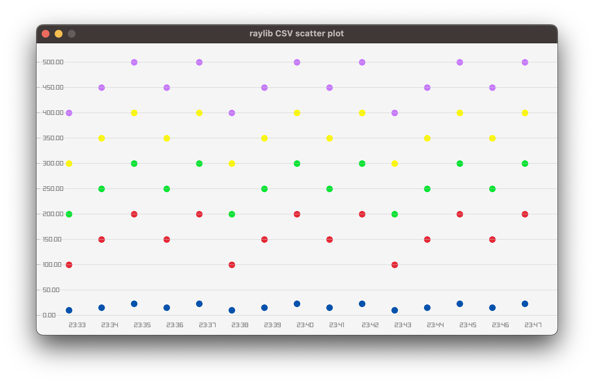

# Raylib CSV Scatter Plot

This repository contains a simple C program that uses the [raylib](https://www.raylib.com/) library to plot a scatter plot from CSV data. The user can drop a CSV file onto the window, and the program will plot the points from the file.



## Structure

- `src/main.c`: Contains the main program logic.
- `data.csv`: Sample CSV data file.

## Features

- **CSV Loading**: The program can load points from a CSV file with the format:
  ```
  time,x,y,z
  2023-08-09 23:33:20T+09:30,10,100,200,300,400
  2023-08-09 23:34:20T+09:30,15,150,250,350,450
  2023-08-09 23:35:20T+09:30,22,200,300,400,500
  2023-08-09 23:36:20T+09:30,15,150,250,350,450
  2023-08-09 23:37:20T+09:30,22,200,300,400,500
  ...
  ```
- **Interactive Plotting**: Drop a CSV file onto the window to plot the points.
- **Scalable Axes**: The x and y axes are drawn with a scale to provide context for the plotted points.

## How to Run

1. Ensure you have `raylib` installed.
2. Compile the program using the provided Makefile or using the following `clang` command:
   ```
   clang -o bin/app src/main.c -I/path_to_raylib_include/ -L/path_to_raylib_lib/ -lraylib -framework IOKit -framework Cocoa -framework OpenGL
   ```
   Replace `/path_to_raylib_include/` and `/path_to_raylib_lib/` with the appropriate paths to your raylib installation.
3. Run the compiled executable.
4. Drag and drop a CSV file onto the window to visualise the data.

## Code Overview

The main components of the code are:

- **Point Struct**: Represents a 2D point with x and y coordinates.
- **LoadCSVData Function**: Loads data from a CSV file into a dynamic array of points.
- **Main Loop**: Handles the raylib window, checks for file drops, and draws the scatter plot and axes.

For a detailed look, refer to the comments and docblocks in `src/main.c`.
